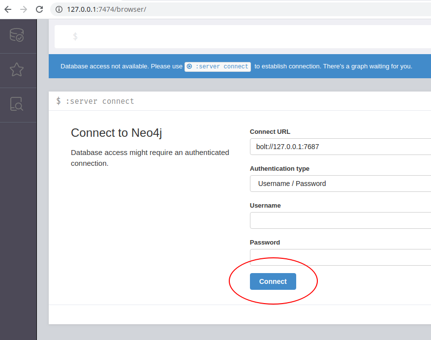

# HCA Ingest Service Graph Validation Suite

## What is this useful for in the scope of the HCA:

1. Enables data wranglers to visually analyze the relationships inside a submission to look for inconsistencies.
2. Provides an automated graph validator for which to create tests using step 1 and can be run fully containerized.


## Features

The suite is divided in two separate, extensible parts:

* **hydrators** enable users to import and populate data into a graph database. The reason not to call them importers is `import` is a reserved keyword in Python and `from importers import importer` is a bit confusing. :dizzy_face:

* **actions** provide different tools to work with the generated graph. The first and most important is to run a series of tests to validate the constraints Data Wranglers want to impose on submissions. Another action is generating reports and extracting statistics from the graph to send to the submitters. Any other actions can be implemented to extend the suite.

## Functionality

So far, the functionality planned is as follows (WIP items are still not fully implemented):

* Hydrators:
    * Ingest Service Spreadsheet.
    * Ingest Service API Submission.
    * BioSamples API (WIP).

* Actions:
    * Opening an interactive visualizer to query the graph.
    * Running tests on the graph.
    * Generating reports for the graph (WIP).


## Installation

The Graph Validator Suite requires docker running in the host machine.

### From the git repo

```
git clone git@github.com:HumanCellAtlas/ingest-graph-validator.git
cd ingest-graph-validator
pip install .
```

### <a name="install_pypi"></a>From PyPI

A Python package has been published in (PyPI)[https://pypi.org/project/ingest-graph-validator].

```pip install ingest-graph-validator```

If you install the Graph Validator Suite this way, you should head to the [github repo](https://github.com/HumanCellAtlas/ingest-graph-validator) to get the [graph tests](https://github.com/HumanCellAtlas/ingest-graph-validator/tree/master/graph_test_set) and the [graph reports](https://github.com/HumanCellAtlas/ingest-graph-validator/tree/master/graph_report_set).


## Usage

### Step by step usage for data wranglers

1. Once [installed from the Python package](#install_pypi), start the backend by opening a terminal and typing:

    `ingest-graph-validator init`

    **Keep in mind**, first time executing the `init` command will take longer as it has to pull the Neo4j Docker image from dockerhub.

2. Import a spreadsheet:

    `ingest-graph-validator hydrate xls <spreadsheet filename>`

3. Go to <http://localhost:7474> in a browser to open the frontend.

4. Connect to the backend (you do not need to change any fields, leave username/password empty):

   

5. You can then start writing [cypher queries](https://neo4j.com/graphacademy/online-training/introduction-to-neo4j/) in the input field on top of the web frontend to visualize the graph. For example:

    ```MATCH p=(n) RETURN p```

    Will show the entire graph. Keep in mind this will crash the browser on huge datasets.

**Note**
The server backend will continue running in the background, and you only need to open the browser again to continue your work. If you want to shutdown the backend, open a terminal and type:

`ingest-graph-validator shutdown`


### More help

The Graph Validator Suite uses a CLI similar to [git](https://git-scm.com/). Running a command without specifying anything else will show help for that command. At each level, the commands have different arguments and options. Running any subcommand with `-h` or `--help` with give you more information about it.

The root level commands are:

* **`ingest-graph-validator init`** starts the database backend and enables a frontend visualizer to query the database, in `http://localhost:7474` by default.

* **`ingest-graph-validator hydrate`** shows the list of available hydrators.

* **`ingest-graph-validator actions`** shows the list of available actions.

* **`ingest-graph-validator shutdown`** stops the backend.


## Containerized execution

WIP


# Extra stuff

## Useful cypher queries

### Show all nodes and relationships
```
MATCH p = (n)
RETURN p
```

### Show all nodes and relationship excluding some
```
MATCH p = (n)
WHERE NOT n:LABEL AND NOT n:LABEL
RETURN p
```

### Expands paths from a node
This one will be shown with an example. The example selects the donor CBTM-376C from [Meyer's Tissue Stability](https://ui.ingest.data.humancellatlas.org/submissions/detail?uuid=fd52efcc-6924-4c8a-b68c-a299aea1d80f) dataset, and expands the paths to show all biomaterials, processes and files linked to it.

**Note**: Make sure to strictly define **only one node** to use as the source, otherwise it will be confusing.

**Note**: You have to be careful not to include nodes that would link your path to another one. For example, `protocol` or `project` are linked to more than one _experimental design_.

The first two lines are used to select one single node from which to expand. The third line expands the path using these parameters:

1. `n`, the starting node or nodes (preferably one for your first queries).
2. `""`, the [relationship filter](http://neo4j-contrib.github.io/neo4j-apoc-procedures/3.5/path-finding/path-expander/#_relationship_filter). We are not filtering by any relations in this query.
3. `"-project|-protocol"`, the [label filter](http://neo4j-contrib.github.io/neo4j-apoc-procedures/3.5/path-finding/path-expander/#_label_filter). We are excluding (hence the minus sign) any nodes with the labels `project` or (that is represented by the `|`) `protocol`.
4. `0` is the minimum depth. Normally 0. Otherwise the starting nodes get excluded.
5. `-1` is used to determine the maximum depth for the path expansion. -1 means no limit. If you would set a 1 here, the result would be the `CBTM-376C` donor and its first level neighbours.

```
MATCH (n:donor_organism)
WHERE n.`biomaterial_core.biomaterial_id` = "CBTM-376C"
CALL apoc.path.expand(n, "", "-project|-protocol", 0, -1) YIELD path
RETURN path
```


## List of Ingest submission IDs

* KidneySingleCellAtlas: d5410c6e-612d-421a-a66f-2de5e04dd050
* HumanColonicMesenchymeIBD: c51efa69-a348-46d4-9997-c7a11915d53b
* scRNAseqSystemicComparison: d1610c4a-76c6-4b69-af63-c74af869fa75
* TissueStability: fd52efcc-6924-4c8a-b68c-a299aea1d80f
* demo HPSI human cerebral organoids: 6f33a6c6-170d-460b-bbba-9668e9d77aaf
* Mouse Melanoma: 4756b97c-3666-4ff0-9c48-611dc06b7740
* Multiplexed scRNA-seq with barcoded antibodies: 6931d821-9cd2-4ae1-acf7-62cd3b90082e
* Reprogrammed_Dendritic_Cells: 8c45a848-ab32-4928-8dd6-567b75eaf7e1
* HPSI human cerebral organoids: fce97270-fce0-4744-8a4e-a93d95521852
* Tabula Muris: 14df1f92-155c-4da2-97fc-85601dee64da
* snRNA-seq_for_human_retina: 7d515499-b5b6-4083-95cd-6a393344865e
* Healthy and type 2 diabetes pancreas: c81f7d54-a27f-4212-a6df-88dde947f7cc
* Single cell transcriptome analysis of human pancreas: 5cd8b827-e4fa-4ffa-86f5-f0f8302baee9
* SingleCellLiverLandscape: 1e2601a5-8938-446c-bbb3-1f37a84b11da
* WongAdultRetina: 668791ed-deec-4470-b23a-9b80fd133e1c
* Single cell RNAseq characterization of cell types produced over : 0948a727-228f-4cfc-857e-6243c6aed08d
* Kidney biopsy scRNA-seq: 588281cb-93e2-4888-b75e-5cee5e39fc7f
* BM_PC: 67abd7a1-644b-48d0-b8b8-251d8195a742
* Human Hematopoietic Profiling: 7dbcf5ae-f8d7-487c-a3d4-794d8639a1e2
* Mouse Endoderm Project: 0fb44736-c50f-49ab-bcdc-0985e596b955
* Drop-seq, DroNc-seq, Fluidigm C1 Comparison: bf3116e5-1af1-46c2-8bbd-44dac49d1e7f
* 1M Immune Cells: 85e72912-9f91-4489-8169-3b43cc65a16a
* 1M Neurons: 064d36ca-ea4d-428f-b30f-0cf5e5350a9d
* MouseGastrulationAtlas: 19c5c89a-7bfb-4b4d-9ff5-3ef009304ba5
* Fetal/Maternal Interface: 46fe8bd7-329b-4f09-b227-5ee48c109c16
* Tissue stability: 02e89f20-84c8-4daa-aaeb-80f4a85733ff
* CD4+ cytotoxic T lymphocytes: 3bb965cb-2a6f-4802-a4f2-52d0423e6ecc
* Diabetic Nephropathy snRNA-seq: a69c731b-9db7-45e3-938f-daf2e4636a6e
* HDCA-Sweden-10x: 071fc37f-1a01-4cf7-a6f5-2662c42c12b6
* HumanTissueTcellActivation: 8b5feb5e-9039-4c54-9e79-053e490c141a
* HumanMousePancreas: 7b4cd093-bfa5-477e-9c95-69bafc1cb6bf

## Credits

This package was created with [Cookiecutter](https://github.com/audreyr/cookiecutter).

.

